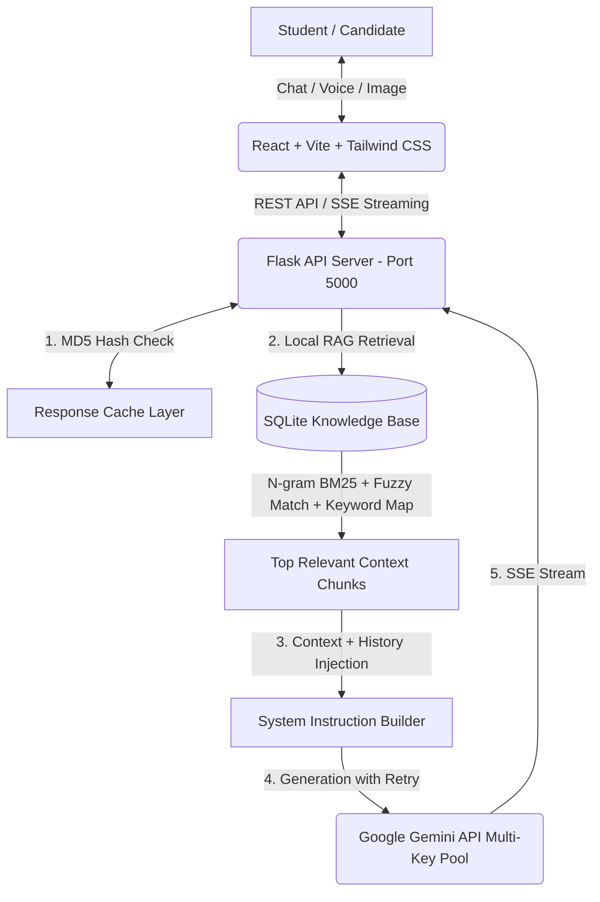

# 🎓🤖 Asia University Vietnam - AI Admission Consultant System

An enterprise-grade, automated admission consulting and career guidance system powered by **Artificial Intelligence (Google Gemini 2.5 Flash)** and a **Zero-Cost Hybrid Local RAG Engine**, specifically engineered for **Asia University Vietnam**.

---

## 🌟 Key Features

### For Students & Candidates (Frontend UI)
- **⚡ Real-Time Streaming (SSE):** Experiences instant, word-by-word streaming responses powered by Server-Sent Events (SSE), delivering a smooth ChatGPT-like user experience.
- **🌐 Intelligent Bilingual Support (VI/EN):** Seamlessly switch between English and Vietnamese. The AI dynamically adapts its tone, terminology, and language constraints based on UI toggle or direct user input language detection.
- **🎯 Dynamic Career Quiz:** An interactive vocational assessment tool that evaluates student personality, academic strengths, and career aspirations to recommend one of Asia University Vietnam's 4 core majors: *Artificial Intelligence, Semiconductor Technology, Finance, or Business Administration*.
- **📸 Multimodal Transcript Analysis:** Supports base64 image uploads (e.g., high school academic transcripts, English certificates), allowing the AI to read document contents and provide instant eligibility evaluations.
- **📝 Automated Lead Capture & CRM Integration:** A non-intrusive registration modal automatically prompts candidates after meaningful engagement to capture contact information (Name, Email, Phone, Major of Interest) for the admission team.

### For Administrators (Admin Dashboard)
- **🔒 Protected Access:** Secure management portal accessible via `/admin` (Default password: `admin123`).
- **📊 Lead CRM & CSV Export:** View real-time prospective student leads with filtering capabilities and one-click CSV export for recruitment campaigns.
- **💬 Conversation Analytics:** Full visibility into student-AI chat logs to track trending questions, student sentiment, and consulting quality.
- **📁 Document & Knowledge Management:** Directly upload new admission guidelines, scholarship policies, or announcements (`.txt`, `.pdf`, `.docx`, etc.) via the web UI. Supports instant deletion, file viewing, and automatic SQLite database re-indexing.

---

## 🏗️ System Architecture & Technical Highlights



### 1. Zero-Cost Hybrid Local RAG Engine
To overcome the high API costs and rate limits of cloud vector embeddings, we designed an optimized local CPU-based retrieval pipeline:
- **N-gram BM25 Okapi:** Upgraded from standard unigrams to **1, 2, and 3-gram tokenization**, perfectly preserving Vietnamese compound words (e.g., `"cơ sở"`, `"địa chỉ"`, `"học phí"`, `"điểm chuẩn"`).
- **Fuzzy Title Matching:** Utilizes `thefuzz` (Levenshtein distance) to score document headers and handle user typos or phonetic misspellings gracefully.
- **Semantic Paragraph Chunking:** Documents are segmented by natural paragraph boundaries (`\n\n`) with intelligent length capping (1200 chars) to preserve semantic context without fragmenting sentences.
- **Bilingual Keyword Mapping:** A comprehensive domain dictionary automatically bridges English queries (`major`, `tuition`, `scholarship`, `address`, `campus`, `lecturer`...) to Vietnamese knowledge base chunks, enabling zero-latency cross-lingual RAG without external translation APIs.

### 2. Multi-Key Rotation & Automatic Fallback Pool
- **API Key Pool (`AI_API_KEYS`):** Dynamically rotates across multiple Google Gemini API keys to distribute load and prevent quota exhaustion.
- **Fault-Tolerant Fallback:** Automatic exponential backoff and model degradation from `gemini-2.5-flash` to lightweight models (`gemini-2.5-flash-lite`) upon encountering HTTP 429 (Rate Limit) or quota exceptions, ensuring 99.9% system availability.

### 3. Context-Aware Streaming Cache
- **MD5 History Hashing:** The caching mechanism hashes the exact conversation history (`history_hash`) combined with language toggle and normalized query strings.
- **Streaming Cache Replay:** Cache hits bypass Google API entirely, simulating natural character-chunked streaming via SSE while preserving complex Markdown formatting (tables, bullet points, line breaks).

---

## 🛠️ Technology Stack

| Layer | Technologies Used |
| :--- | :--- |
| **Frontend** | React 18, Vite, Tailwind CSS, React Router, Lucide Icons, React-Markdown |
| **Backend** | Python 3.10+, Flask, Flask-CORS, Werkzeug |
| **Database** | SQLite 3 (`database.db` - Tables: `knowledge_base`, `chat_logs`, `leads`) |
| **AI & RAG** | Google GenAI SDK (`gemini-2.5-flash` / `flash-lite`), Rank-BM25, TheFuzz |
| **Deployment** | Cloud-ready (Render / Vercel / Docker compatible) & Cloudflare Tunnels |

---

## 🚀 Setup & Installation Guide

### Prerequisite Requirements
- **Node.js:** v18.0.0 or higher
- **Python:** v3.9.0 or higher
- **Git:** Latest version

### Step 1: Clone & Configure Dependencies
1. Clone the repository and navigate to the project root:
   ```bash
   git clone https://github.com/nguyenkhang1901/Advanced-Computer-Programming_Project.git
   cd Advanced-Computer-Programming_Project
   ```
2. Install Frontend dependencies:
   ```bash
   cd frontend
   npm install
   cd ..
   ```
3. Install Backend dependencies:
   ```bash
   cd backend
   pip install -r requirements.txt
   cd ..
   ```

### Step 2: Environment Configuration
1. Navigate to the `backend/` directory.
2. Copy `.env.example` to create a new `.env` file:
   ```bash
   cp backend/.env.example backend/.env
   ```
3. Open `backend/.env` and insert your free Google Gemini API keys (comma-separated if multiple):
   ```env
   AI_API_KEYS="AIzaSy...YourKey1...,AIzaSy...YourKey2..."
   MODEL_NAME="gemini-2.5-flash"
   ```

### Step 3: Running the Application (Windows Quick-Start)
The project includes an automated startup script for Windows developers:
1. Double-click **`run.bat`** in the project root.
2. Select your preferred execution mode:
   - **Mode [1] - Offline Dev Mode:** Starts Flask API (Port 5000) and Vite Dev Server (Port 5173) in separate windows with hot-module reloading enabled.
   - **Mode [2] - Public Demo Mode (Cloudflare Tunnel):** Builds the production React bundle, serves full-stack on Port 5000, and automatically generates a secure public HTTPS URL (e.g., `https://random-words.trycloudflare.com`) for external sharing and demos.

---

## 📍 University Campus Information
- **Institution:** Asia University Vietnam (AUV)
- **Ho Chi Minh City Campus:** `485 Lê Quang Định, Phường Hạnh Thông, TP. Hồ Chí Minh`
- **Hanoi Campus:** `No. 80 Duy Tan Street, Cau Giay District, Hanoi`
- **Core Majors:** Artificial Intelligence (AI), Semiconductor Technology, Finance, Business Administration.

---

## 👥 Contributors & Project Management
Developed as part of the **Advanced Computer Programming** course project.
- **Version Control & CI/CD:** Active sprint iterations managed via GitHub commit history, tracking bug resolutions, RAG algorithm optimizations, and UI/UX enhancements.
- **License:** MIT License. All rights reserved for educational and demo purposes.
