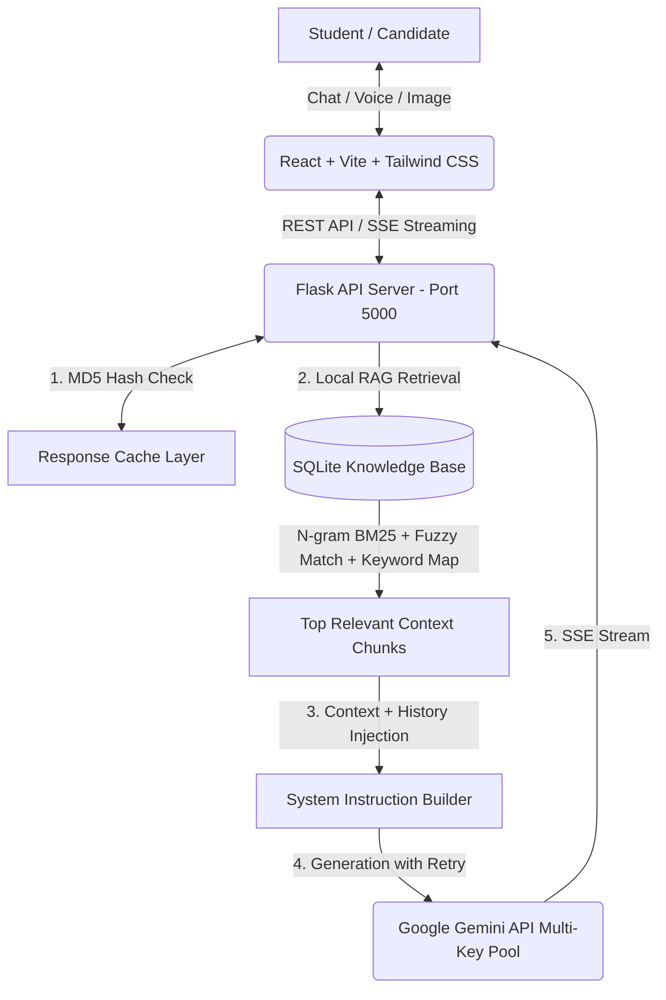

# 🎓🤖 Asia University Vietnam - AI Admission Consultant System

An enterprise-grade, automated admission consulting and career guidance system powered by **Artificial Intelligence (Google Gemini 3.5 Flash Lite)** and a **Zero-Cost Hybrid Local RAG Engine**, specifically engineered for **Asia University Vietnam**.

## 🚀 🌐 LIVE CLOUD DEMO

The system is fully deployed 24/7 on cloud infrastructure. No complex local installation is required for demonstration purposes. Simply click the link below to access and experience the system immediately:

👉 **LIVE WEB APP PORTAL:** [**https://asia-uni-admission.vercel.app**](https://asia-uni-admission.vercel.app) 👈

*(The web application is fully responsive and runs smoothly on desktops, tablets, and mobile devices).*

---

## 🌟 Key Features

### For Students & Candidates (Frontend UI)
- **⚡ Real-Time Streaming (SSE):** Experiences instant, word-by-word streaming responses powered by Server-Sent Events (SSE), delivering a smooth ChatGPT-like user experience.
- **🌐 Intelligent Bilingual Support (VI/EN):** Seamlessly switch between English and Vietnamese. The AI dynamically adapts its tone, terminology, and language constraints based on UI toggle or direct user input language detection.
- **🎯 Dynamic Career Quiz:** An interactive vocational assessment tool that evaluates student personality, academic strengths, and career aspirations to recommend one of Asia University Vietnam's 4 core majors: *Artificial Intelligence, Semiconductor Technology, Finance, or Business Administration*.
- **📸 Multimodal Transcript Analysis:** Supports base64 image uploads (e.g., high school academic transcripts, English certificates), allowing the AI to read document contents and provide instant eligibility evaluations.
- **📝 Automated Lead Capture & CRM Integration:** A non-intrusive registration modal automatically prompts candidates after meaningful engagement to capture contact information (Name, Email, Phone, Major of Interest) for the admission team.

### For Administrators (Admin Dashboard)
- **🔒 Protected Access:** Secure management portal accessible via `/admin` (Default password: `admin123`).
- **📊 Lead CRM & CSV Export:** View real-time prospective student leads with filtering capabilities and one-click CSV export for recruitment campaigns.
- **💬 Conversation Analytics:** Full visibility into student-AI chat logs to track trending questions, student sentiment, and consulting quality.
- **📁 Document & Knowledge Management:** Directly upload new admission guidelines, scholarship policies, or announcements (`.txt`, `.pdf`, `.docx`, etc.) via the web UI. Supports instant deletion, file viewing, and automatic SQLite database re-indexing.

---

## 💻 System Requirements
To run or develop the AI Admission Consultant System locally, your environment must meet the following minimum system requirements:

- **Operating System:** Windows 10 / Windows 11 (Recommended for automated `.bat` scripts), macOS, or Linux (Ubuntu/Debian/CentOS).
- **Node.js:** v18.0.0 or higher (with `npm` v9.0.0+ for frontend package management).
- **Python:** v3.10.0 or higher (with `pip` and virtual environment support).
- **Git:** Latest stable version for version control and repository cloning.
- **Hardware:** Minimum 4GB RAM, dual-core CPU (required for local N-gram BM25 lexical indexing and real-time chunk tokenization without external cloud vector databases).
- **Internet Connection:** Required for querying Google Gemini GenAI cloud endpoints.

---

## 📥 Installation Steps
Follow these step-by-step instructions to set up the project from scratch on your local machine:

### Step 1: Clone the Repository
Open your terminal or command prompt and clone the source code from GitHub:
```bash
git clone https://github.com/nguyenkhang1901/Advanced-Computer-Programming_Project.git
cd Advanced-Computer-Programming_Project
```

### Step 2: Install Frontend Dependencies
Navigate into the `frontend` directory and install the necessary React & Node.js packages:
```bash
cd frontend
npm install
cd ..
```

### Step 3: Install Backend Dependencies
Navigate into the `backend` directory and install the required Python packages:
```bash
cd backend
pip install -r requirements.txt
cd ..
```

### Step 4: Configure Environment Variables (.env)
The backend requires Google Gemini API keys to power the AI responses and fallback rotation pool.
1. Navigate to the `backend/` directory.
2. Copy the sample environment file `.env.example` to create your local `.env` file:
   ```bash
   cp backend/.env.example backend/.env
   ```
3. Open `backend/.env` in a text editor and insert your free Google Gemini API keys (comma-separated if using multiple keys for rotation):
   ```env
   AI_API_KEYS="AIzaSy...YourKey1...,AIzaSy...YourKey2..."
   MODEL_NAME="gemini-3.5-flash-lite"
   ```
   *(Note: You can obtain free API keys from Google AI Studio at `https://aistudio.google.com/`).*

---

## 📦 Dependencies & Libraries
The system relies on a curated list of high-performance libraries and frameworks across the full-stack architecture:

### Backend Dependencies (Python - `backend/requirements.txt`)
- **`flask` (v3.0+) & `flask-cors`:** Core WSGI web application framework and Cross-Origin Resource Sharing handler for RESTful API and Server-Sent Events (SSE) endpoints.
- **`google-genai` / `google-generativeai`:** Official Google GenAI SDK for streaming content generation, vision multimodal analysis, and model fallback execution (`gemini-3.5-flash-lite`).
- **`rank-bm25`:** High-speed lexical search algorithm implementing N-gram Okapi BM25 for local RAG chunk scoring.
- **`thefuzz` & `python-Levenshtein`:** Fuzzy string matching library utilizing Levenshtein distance to score document titles and gracefully handle user typos or phonetic misspellings.
- **`beautifulsoup4` & `requests`:** HTML parsing and HTTP request automation libraries used in `crawler.py` to ingest live admissions articles from official university web pages.
- **`werkzeug`:** WSGI utilities providing secure filename handling and multipart file upload processing for the Admin Knowledge Base portal.

### Frontend Dependencies (Node.js / React - `frontend/package.json`)
- **`react` & `react-dom` (v19.x):** Modern component-based UI library for building reactive client-side interfaces.
- **`vite` (v8.x):** Next-generation frontend build tool and ultra-fast Hot Module Replacement (HMR) development server.
- **`tailwindcss` (v3.x):** Utility-first CSS framework enabling responsive, modern, and aesthetic styling (dark mode, glassmorphism, dynamic gradients).
- **`lucide-react`:** Comprehensive suite of clean, customizable SVG icons for interactive UI elements.
- **`react-markdown` & `remark-gfm`:** Advanced Markdown rendering engine supporting GitHub Flavored Markdown (tables, syntax highlighting, lists, bold formatting) in real-time AI chat streams.
- **`axios`:** Promise-based HTTP client for managing REST API communications between client and server.
- **`react-router-dom` (v7.x):** Client-side routing library managing navigation across Chat, Career Quiz, and Admin portals.
- **`recharts`:** Composable charting library used in the Admin Dashboard to visualize analytics, lead statistics, and chat metrics.

---

## ⚙️ Execution Procedures
You can execute and run the system locally using either **manual terminal commands** (cross-platform compatible) or the **automated Windows quick-start script**.

### Option A: Manual Terminal Commands (Cross-Platform: Windows, macOS, Linux)
To run the full-stack application manually, open **two separate terminal windows**:

1. **Start the Backend API Server (Terminal Window 1):**
   ```bash
   cd backend
   python server.py
   ```
   *The Flask API server and SQLite database engine will initialize and listen on `http://localhost:5000`.*

2. **Start the Frontend Web Server (Terminal Window 2):**
   ```bash
   cd frontend
   npm run dev
   ```
   *The Vite development server will start on `http://localhost:5173`. Open this link in your web browser to use the application.*

### Option B: Automated Startup (Windows Quick-Start Script)
For Windows developers, the project includes an all-in-one automation script:
1. Double-click **`run.bat`** in the project root directory.
2. Select your preferred execution mode:
   - **Mode `[1]` - Offline Dev Mode:** Automatically launches both the Flask Backend (Port 5000) and Vite Frontend Dev Server (Port 5173) in separate command windows with HMR enabled.
   - **Mode `[2]` - Public Demo Mode (Cloudflare Tunnel):** Builds the production React bundle, serves the full-stack application natively on Port 5000, and automatically generates a secure public HTTPS URL (e.g., `https://random-words.trycloudflare.com`) for sharing live demos with advisors or clients.

---

## 💡 Sample Usage
Once the application is running (locally or via the live cloud link at [https://asia-uni-admission.vercel.app](https://asia-uni-admission.vercel.app)), here are concrete examples of how students and administrators can interact with the AI assistant:

### 1. Bilingual Admission Consulting
- **Student Prompt (Vietnamese Example):** *"Trường mình có cơ sở ở TP.HCM không? Địa chỉ chính xác là gì và học phí ngành AI là bao nhiêu?"* (Does the university have a campus in HCMC? What is the exact address and tuition fee for the AI major?)
- **AI Response (Streaming via RAG):**
  > **Asia University Vietnam (AUV)** currently has a campus in Ho Chi Minh City!
  > - **📍 HCMC Campus Address:** `485 Le Quang Dinh, Hanh Thong Ward, Ho Chi Minh City`.
  > - **🤖 Artificial Intelligence (AI) Major:** International standard training program with highly preferential tuition fees, supported by leading experts and lecturers. You have the opportunity to receive scholarships from 50% to 100% of tuition fees based on your academic records!
- **Student Prompt (English Switch):** *"Can you tell me about the scholarships available for the Semiconductor Technology major?"*
- **AI Response (EN - Streaming):**
  > Asia University Vietnam offers prestigious merit-based scholarships for the **Semiconductor Technology** program! High-achieving candidates can qualify for 50%, 80%, or 100% tuition fee waivers. To apply, you need to submit your academic transcripts and English proficiency certificates...

### 2. Interactive Career Quiz
- **User Workflow:** Click the **"Career Quiz"** tab in the navigation bar.
- **Sample Interaction:** Answer 5 multiple-choice questions assessing your personality traits, working style (e.g., analytical solving vs. creative leadership), and academic strengths.
- **AI Diagnosis Result:** The system generates a personalized diagnostic report recommending **Finance** or **Artificial Intelligence**, explaining exactly why your skills match the major and suggesting specific scholarship tracks to pursue.

### 3. Multimodal Document Evaluation
- **User Workflow:** Click the **Paperclip Icon** 📎 in the chat bar and upload an image of your High School Transcript, IELTS Certificate, or Award Diploma.
- **Student Prompt:** *"Here is my high school transcript for the first semester of 12th grade. Can you check if I am eligible for the AI major scholarship?"*
- **AI Response:** The AI vision model reads the academic grades directly from the image, calculates your GPA, evaluates eligibility against AUV's admission rules, and provides immediate feedback on your qualification status.

### 4. Automated Lead Capture
- **User Workflow:** After 3-4 meaningful chat turns, a non-intrusive modal appears inviting the candidate to connect with human admission officers.
- **Sample Submission:** Enter Name (*Nguyen Van A*), Phone (*0901234567*), Email (*nguyenvana@example.com*), and Major of Interest (*Artificial Intelligence*).
- **System Action:** The lead is automatically stored in `database.db` and becomes instantly visible on the Admin Dashboard CRM table for recruitment follow-up.

### 5. Admin Knowledge Base Management
- **Admin Workflow:** Navigate to `/admin` and log in with password `admin123`.
- **Sample Action:** Go to **Knowledge Base Management** -> Click **Upload Document** -> Upload a new text file `scholarship_rules_2026.txt`.
- **System Action:** The backend automatically chunks the document by paragraph boundaries, re-indexes the SQLite BM25 lexical tables, and immediately equips the AI bot to answer student questions using the newly uploaded 2026 rules without requiring server restarts!

---

## 🏗️ System Architecture & Technical Highlights



### 1. Zero-Cost Hybrid Local RAG Engine
To overcome the high API costs and rate limits of cloud vector embeddings, we designed an optimized local CPU-based retrieval pipeline:
- **N-gram BM25 Okapi:** Upgraded from standard unigrams to **1, 2, and 3-gram tokenization**, perfectly preserving compound words.
- **Fuzzy Title Matching:** Utilizes `thefuzz` (Levenshtein distance) to score document headers and handle user typos or phonetic misspellings gracefully.
- **Semantic Paragraph Chunking:** Documents are segmented by natural paragraph boundaries (`\n\n`) with intelligent length capping (1200 chars) to preserve semantic context without fragmenting sentences.
- **Bilingual Keyword Mapping:** A comprehensive domain dictionary automatically bridges English queries (`major`, `tuition`, `scholarship`, `address`, `campus`, `lecturer`...) to Vietnamese knowledge base chunks, enabling zero-latency cross-lingual RAG without external translation APIs.

### 2. Multi-Key Rotation & Automatic Fallback Pool
- **API Key Pool (`AI_API_KEYS`):** Dynamically rotates across multiple Google Gemini API keys to distribute load and prevent quota exhaustion.
- **Fault-Tolerant Fallback:** Automatic exponential backoff and retry mechanism using `gemini-3.5-flash-lite` upon encountering HTTP 429 (Rate Limit) or quota exceptions, ensuring 99.9% system availability.

### 3. Context-Aware Streaming Cache
- **MD5 History Hashing:** The caching mechanism hashes the exact conversation history (`history_hash`) combined with language toggle and normalized query strings.
- **Streaming Cache Replay:** Cache hits bypass Google API entirely, simulating natural character-chunked streaming via SSE while preserving complex Markdown formatting (tables, bullet points, line breaks).

---

## ☁️ Live Cloud Deployment (Production)
The application is deployed 24/7 on cloud infrastructure and accessible online for live demonstration:
- **Web App Portal:** [https://asia-uni-admission.vercel.app](https://asia-uni-admission.vercel.app)

---

## 📍 University Campus Information
- **Institution:** Asia University Vietnam (AUV)
- **Ho Chi Minh City Campus:** `485 Le Quang Dinh, Hanh Thong Ward, Ho Chi Minh City`
- **Hanoi Campus:** `No. 80 Duy Tan Street, Cau Giay District, Hanoi`
- **Core Majors:** Artificial Intelligence (AI), Semiconductor Technology, Finance, Business Administration.

---

## 👥 Contributors & Project Management
Developed as part of the **Advanced Computer Programming** course project.
- **Version Control & CI/CD:** Active sprint iterations managed via GitHub commit history, tracking bug resolutions, RAG algorithm optimizations, and UI/UX enhancements.
- **License:** MIT License. All rights reserved for educational and demo purposes.
